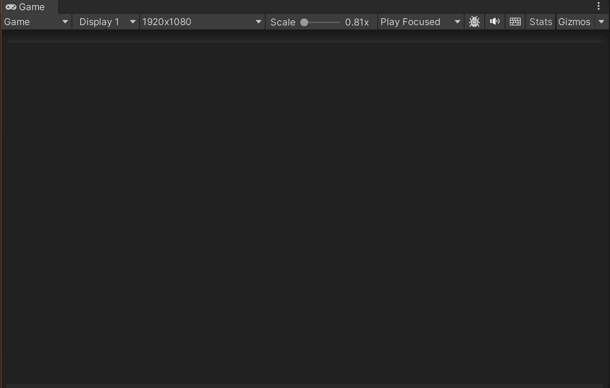

# AI 驱动游戏开发工作流 - MatchThree

> 本文档记录 MatchThree 项目的 AI 辅助开发工作流规范，适用于个人项目开发。



## 核心技术栈

| 工具 | 用途 | 集成方式 |
|------|------|----------|
| **Claude Code** | AI 编程助手，代码生成、调试、重构 | CLI + VSCode Extension |
| **GSD (Get Shit Done)** | 项目管理框架，需求→验证闭环 | Claude Code Skill (`/gsd:quick`, `/gsd:plan-phase`, `/gsd:execute-phase`) |
| **Bezi** | 游戏开发 AI 助手，原型设计、调试、自动化 | Unity 深度集成，项目感知 |
| **Unity** | 游戏引擎，运行时环境 | 本地安装 |

## 工作流架构

```
┌─────────────────────────────────────────────────────────────┐
│                     Claude Code (Orchestrator)               │
│  ┌─────────────┐  ┌─────────────┐  ┌─────────────────────┐  │
│  │ /gsd:quick  │  │/gsd:plan-phase│  │ /gsd:execute-phase │  │
│  │  快速修复    │  │   阶段规划   │  │     阶段执行        │  │
│  └─────────────┘  └─────────────┘  └─────────────────────┘  │
└───────────────────────────┬─────────────────────────────────┘
                            │
                            ▼
┌─────────────────────────────────────────────────────────────┐
│                    GSD Workflow System                        │
│  ┌──────────────┐  ┌──────────────┐  ┌──────────────────┐  │
│  │  .planning/  │  │  STATE.md    │  │   CONTEXT.md     │  │
│  │  需求文档化   │  │  进度追踪    │  │   决策记录       │  │
│  └──────────────┘  └──────────────┘  └──────────────────┘  │
└───────────────────────────┬─────────────────────────────────┘
                            │
                            ▼
┌─────────────────────────────────────────────────────────────┐
│                    Unity + Bezi AI                              │
│  ┌──────────────┐  ┌──────────────┐  ┌──────────────────┐  │
│  │   Assets/    │  │ ProjectSettings│ │   Bezi AI       │  │
│  │   脚本/配置   │  │   场景配置    │  │  项目感知助手   │  │
│  └──────────────┘  └──────────────┘  └──────────────────┘  │
└─────────────────────────────────────────────────────────────┘
```

## GSD 工作流规范

### 1. 快速修复 (`/gsd:quick`)

适用于小型任务：bug 修复、文档更新、配置调整。

```
用户请求 → /gsd:quick → 任务执行 → 提交 → 状态更新
```

**执行要点：**
- 任务保持原子性（单一职责）
- 自动原子提交
- 更新 STATE.md Quick Tasks 表格

### 2. 阶段规划 (`/gsd:plan-phase`)

适用于功能开发、架构重构。

```
研究 (可选) → 规划 → 验证 → 交付
```

**文档输出：**
- `phases/XX-XX-PLAN.md` - 阶段执行计划
- `phases/XX-XX-SUMMARY.md` - 阶段完成总结
- `VERIFICATION.md` - 目标达成验证

### 3. 阶段执行 (`/gsd:execute-phase`)

适用于复杂多任务执行。

```
计划发现 → 依赖分析 → 波次执行 → 验证 → 状态更新
```

**波次机制：**
- 自动分析任务依赖关系
- 并行执行无依赖任务
- 分波次控制执行节奏

## 项目规范

### 模块化 Page 架构

```
Assets/
├── Scripts/
│   ├── Configs/        # 配置数据 (ScriptableObject)
│   ├── GameFlow/       # 游戏流程控制
│   ├── Grid/           # 棋盘逻辑
│   ├── Matching/       # 匹配算法
│   ├── Scoring/        # 计分系统
│   └── UI/             # 界面逻辑
├── Prefabs/            # 预制体资源
├── Config/             # 配置文件 (.asset)
└── Scenes/             # 场景文件
```

### 代码分层

```
┌─────────────────────────────────────────┐
│            Presentation Layer            │
│   UI/  - WinScreen, LoseScreen, Timer   │
└─────────────────┬───────────────────────┘
                  │
┌─────────────────▼───────────────────────┐
│            Game Flow Layer               │
│   GameFlow/  - GameManager, GameState   │
└─────────────────┬───────────────────────┘
                  │
┌─────────────────▼───────────────────────┐
│            Core Game Logic               │
│   Grid/, Matching/  - Tile, Match       │
└─────────────────┬───────────────────────┘
                  │
┌─────────────────▼───────────────────────┐
│            Data Layer                    │
│   Configs/, Scoring/  - Config, Score  │
└─────────────────────────────────────────┘
```

### 组件职责

| 组件 | 职责 | 依赖 |
|------|------|------|
| `GameManager` | 游戏状态控制，单例 | WinScreen, LoseScreen, ScoreManager, GridManager |
| `GridManager` | 棋盘创建、tile 放置 | TileConfig, GridConfig, Tile Prefab |
| `TileInputHandler` | 处理 tile 点击/拖拽 | GameManager.IsGameRunning |
| `ScoreManager` | 计分、目标检测 | GameConfig |
| `TimerDisplay` | 倒计时显示 | GameConfig, GameManager |
| `WinScreen/LoseScreen` | 结束界面显示 | Button.onClick |

## Bezi AI 集成

### Bezi 是什么

Bezi 是一个专为游戏开发设计的 **AI 助手**，具有以下特点：

- **项目感知**：理解当前项目上下文，能够进行针对性辅助
- **Unity 深度集成**：直接与 Unity 编辑器协同工作
- **自动化任务**：帮助原型设计、调试、自动化重复性工作
- **支持个人开发者和工作室**：提升开发效率，允许更多创意探索

### 工作流程

1. **需求沟通** → 向 Bezi 描述游戏功能或设计目标
2. **原型生成** → Bezi 帮助快速创建游戏原型
3. **调试优化** → Bezi 协助定位和修复问题
4. **自动化** → Bezi 处理重复性开发任务

### 当前项目 Bezi 配置

- **Bezi ID**: `.bezisidekick/`
- **Editor Settings**: `.bezisidekick/.settings.json`
- **User Settings**: `.bezisidekick/.user-settings.json`

## 信息管理

### 长对话上下文保持

1. **CLAUDE.md** - 项目级指令，定义技术栈、架构、约束
2. **.planning/STATE.md** - 当前阶段状态、已完成任务
3. **.planning/ROADMAP.md** - 项目路线图
4. **.planning/REQUIREMENTS.md** - 需求池
5. **CONTEXT.md** - 决策记录（使用 `/gsd:quick --discuss` 时生成）

### 上下文丢失恢复

当 AI 重启或对话压缩时：
1. 读取 `CLAUDE.md` 获取项目上下文
2. 读取 `STATE.md` 获取当前进度
3. 按需重建工作状态

---

*本文档由 AI 辅助生成，最后更新：2026-03-28*